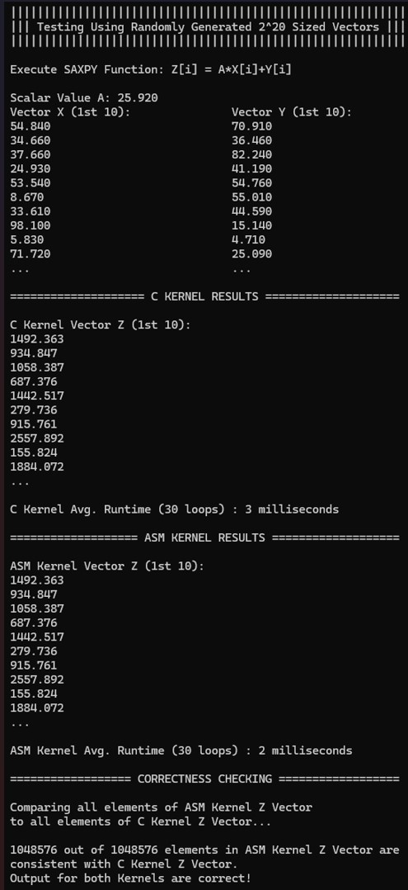
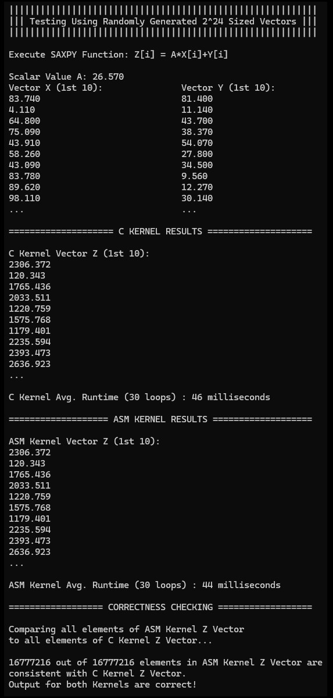
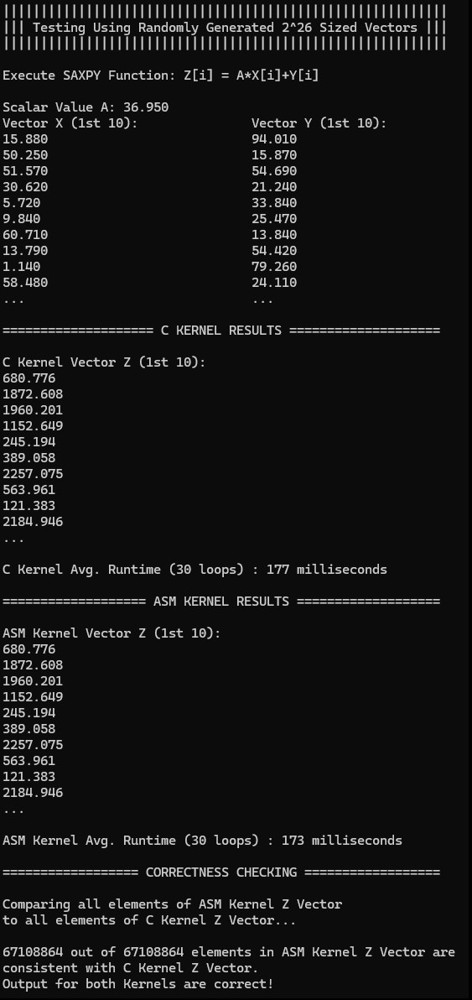
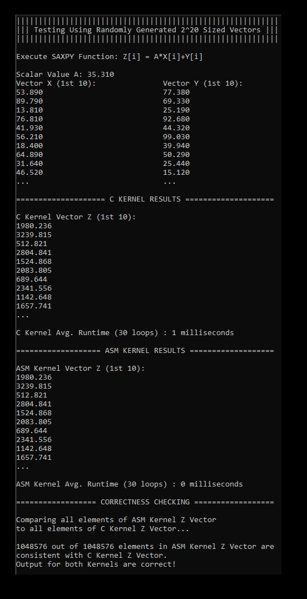
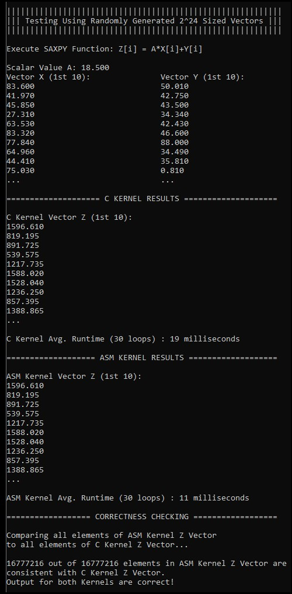
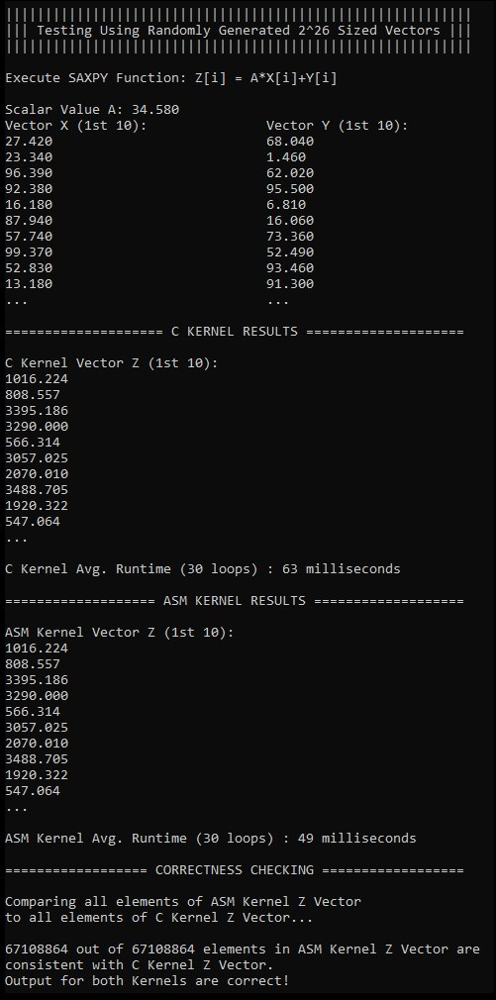

# **Comparative Execution Time**

The performance of the C Kernel and ASM Kernel implementations was tested in both Debug Mode and Release Mode across different sizes of input vectors. The performance between the two kernels is tested on the SAXPY Function. The sizes of the vectors are 2^20, 2^24, and 2^26. The memory limit of the test tool in Visual Studio is only up to a certain limit such that the highest array it can provide is 2^26. 

For Correctness Checking, the C Kernel results will be used as basis. When the ASM Kernel results are consistent with the C Kernel results, then it can be said that the program works properly as intended.

 ## Debug Mode Results

### Debug Mode Result for 2^20 Vector Size

### Debug Mode Result for 2^24 Vector Size

### Debug Mode Result for 2^26 Vector Size

## Release  Mode Results
 
### Release Mode Result for 2^20 Vector Size

### Release Mode Result for 2^24 Vector Size

### Release Mode Result for 2^26 Vector Size

### Debug Mode Results
The following table shows the average run time (in milliseconds) for each implementation:

### Release Mode Results
The following table shows the average run time (in milliseconds) for each implementation:

_The clock() function which was used to time the functions was not able to catch the speed of ASM Kernel as it was below a millisecond._

### Debug Mode Analysis

The ASM Kernel and C Kernel implementations operate similarly in Debug Mode for varying input vector sizes. On the other hand, the ASM Kernel regularly displays marginally shorter average run times than the C Kernel. This might be explained by assembly language allowing for lower-level optimizations that lead to more effective code execution.

In Debug Mode, for 2^20-sized vectors, the ASM Kernel exhibits a 33.33% improvement over the C Kernel. For 2^24-sized vectors, the ASM Kernel demonstrates a 4.35% improvement over the C Kernel. Similarly, for 2^26-sized vectors, the ASM Kernel shows a 2.26% improvement over the C Kernel.

### Release Mode Analysis

When comparing the C Kernel and ASM Kernel implementations in Release Mode to Debug Mode, notable performance improvements are seen. Once more, for all vector sizes, the average run time of the ASM Kernel is often lower than that of the C Kernel. 

In Release Mode, for 2^20-sized vectors, the ASM Kernel displays a 100% improvement over the C Kernel. For 2^24-sized vectors, the ASM Kernel exhibits a 42.11% improvement over the C Kernel. Likewise, for 2^26-sized vectors, the ASM Kernel shows a 22.22% improvement over the C Kernel

### Graph

The graph above shows the results in line graph form. Based from the results, Assembly is always faster than C, even if its just a few milliseconds of difference. Release Mode also accentuates this difference as the kernels run even faster and Assembly is able to operate in less than a millisecond with 2^20 sized vectors.

### Conclusion

The performance analysis indicates that the ASM Kernel implementation offers better execution times than the C Kernel, particularly in Release Mode. This may be due to the fact that Assembly language controls the hardware directly, which does not have overhead that is usually present in high-level programming languages like C. C has 'overhead' or a bit more execution time because it calls the C runtime library, wherein Assembly is able to call the hardware directly without any runtime libraries needed, causing it to have a slight speed advantage.

As for the execution time differences between the Release Mode and the Debug Mode of the kernels in Visual Studio, Release Mode is faster because it has a lot of optimizations turned on. Optimizations such as 'Method Inlining' and 'Loop Unrolling' are some of the optimizations activated when Visual Studio is running the code in Release Mode. Debug Mode in Visual Studio has these optimizations turned off in order to make sure the program runs properly. Release Mode may have bugs and errors as a trade-off for faster execution speeds.

Even though Assembly can be faster than C, this is only a few milliseconds of difference. Maybe a larger test involving a larger program is in line in order to test how significant the difference actually is in practical application.

